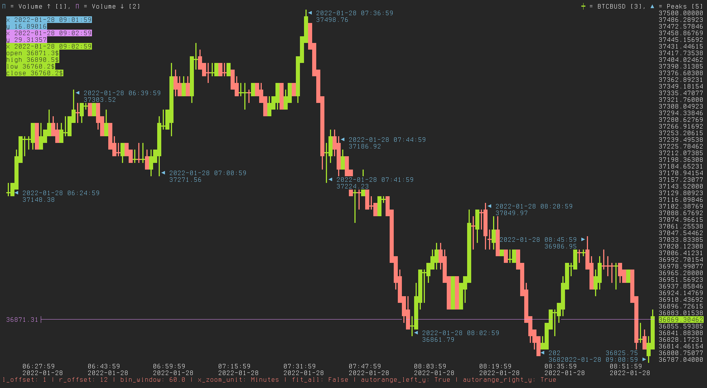
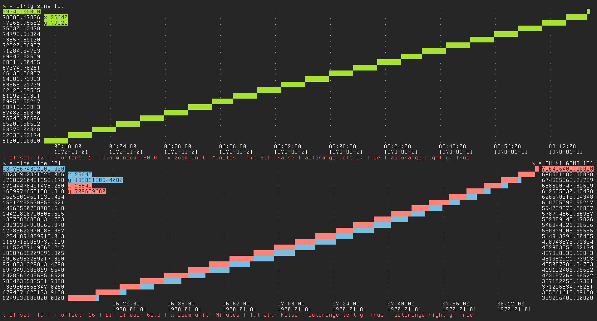

# tplot :: A terminal plotting library written in python

This is a work in progress.  

## Features
- pure python
- fast live plotting
- candlesticks and lines
- ncurses interface
- menu API
- double axis
- split screen
